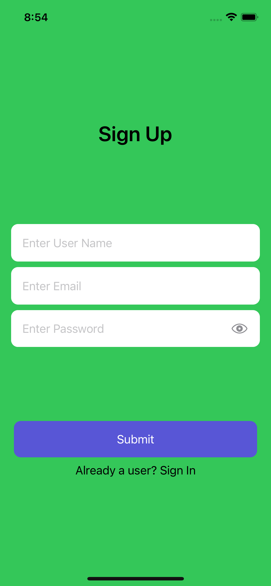

# IOS-APPWRITE-TODO
This is a todo app in swift IOS using appwrite.
## 1. Appwrite - Backend as a service
## 2. Environment objects
## 3. Observables
## 4. Swift UI
## 5. MVVM architecture

  
  
  

  

